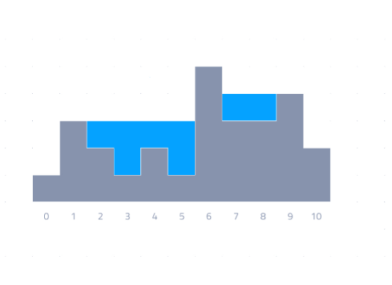

# Test task
У вас есть друг. Он работает геологом и исследует область с горными озерами. В недавнем времени в этой местности прошли ливни, и уровень горных озер достиг самого высокого уровня за все время исследований. Вашего друга интересует максимальный уровень воды в самой глубокой части озера.
Для простоты рассмотрим проблему в 2-D координатах. Ландшафт может быть разделен на маленькие блоки и описан как массив. Каждый элемент массива это высота элемента озера над уровнем моря. Ваша задача - узнать максимальный уровень воды после наводнения. Можно предположить, что высота над уровнем моря за пределами этой зоны ноль и может содержать бесконечное количество воды.

Например, рассмотрим массив A:

A[0] = 1 
A[1] = 3 
A[2] = 2 
A[3] = 1 
A[4] = 2 
A[5] = 1 
A[6] = 5 
A[7] = 3 
A[8] = 3 
A[9] = 4 
A[10] = 2

Картинка ниже иллюстрирует ландшафт после наводнения.

Серая область - это скальная поверхность, обозначенная как массив A выше, а синяя область обозначает воду после наводнения. Таким образом, блоки 3 и 5 имеет уровень воды 2 тогда как блоки 2,4,7,8 имеют уровень воды 1. Поэтому максимальный уровень воды в этой области - 2.

Ваша задача - написать функцию:

function solution($A);

на вход которой будет дан непустой массив состоящий из N целых значений, и которая будет возвращать целое положительное число, характеризующее максимальную глубину воды.

Для массива A, описанного выше, результат работы данной функции будет 2.

Для массива данного вида:

A[0] = 5 
A[1] = 8

Функция должна вернуть 0 потому что такой ландшафт не может содержать воды.

N имеет тип integer в диапазоне [1..100000]
Каждый элемент массива A - целое число в диапазоне [1..100000000]

Сложность:
Ожидаемая временная сложность O(N)
Ожидаемое потребление памяти - O(N) (не учитывая память для входных параметров)

Дополнительно (и для облегчения определения правильного алгоритма) можно написать ряд тестов, тестирующих выполнение данной функции с разными входными параметрами.
Для правильного решения задачи необходимо тщательно продумать все возможные варианты входных массивов.
Также надо обратить внимание на требования по сложности алгоритма.
Время на выполнение задания - 24 часа.
Результат выложить на гитхаб в виде файла с готовой функцией (+ возможно тесты).

